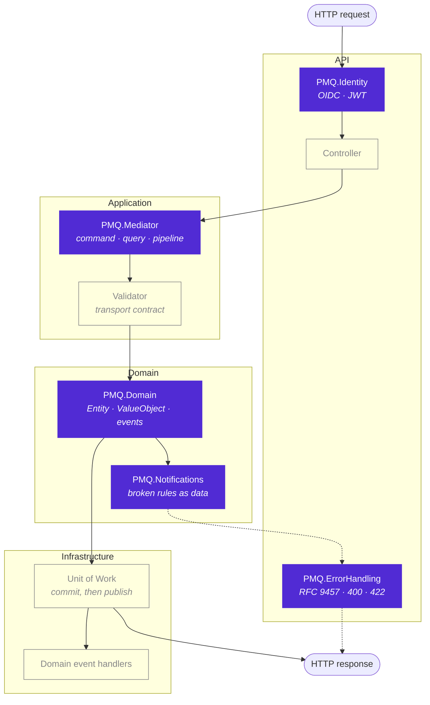

<h1 align="center">Pablo Mickael Quevedo</h1>

<p align="center">
  <strong>.NET Architect · Distributed Systems · Payments &amp; Industrial IoT</strong>
</p>

<p align="center">
  Architecture and engineering for the systems behind a 14-company group and <strong>R$ 3B</strong> in revenue.<br />
  Former Tech Lead of the cross-cutting systems team at Grupo Herval — today responsible for the<br />
  highest-complexity projects across a portfolio of roughly <strong>150 repositories</strong>.
</p>

<p align="center">
  
  
  
  
  
</p>

---

## Open Source

A set of production libraries extracted from systems that run in production, not from tutorials.
Each one solves a problem I kept re-solving by hand across repositories.

| Package | What it solves | Version | Downloads |
|---|---|---|---|
| [**PMQ.Domain**](https://github.com/PabloMickaelQuevedo/PMQ.Domain) | DDD building blocks — entities with identity-based equality, aggregate roots, value objects and domain events | [](https://www.nuget.org/packages/PMQ.Domain) |  |
| [**PMQ.Mediator**](https://github.com/PabloMickaelQuevedo/PMQ.Mediator) | CQRS mediator with pipeline behaviors, streaming and FluentValidation integration | [](https://www.nuget.org/packages/PMQ.Mediator) |  |
| [**PMQ.Notifications**](https://github.com/PabloMickaelQuevedo/PMQ.Notifications) | Notification pattern — business rules as data instead of exceptions | [](https://www.nuget.org/packages/PMQ.Notifications) |  |
| [**PMQ.ErrorHandling**](https://github.com/PabloMickaelQuevedo/PMQ.ErrorHandling) | Centralized ASP.NET Core error handling with RFC 9457 responses | [](https://www.nuget.org/packages/PMQ.ErrorHandling) |  |
| [**PMQ.Identity**](https://github.com/PabloMickaelQuevedo/PMQ.Identity) | Provider-agnostic authentication — external OIDC or self-issued JWT | [](https://www.nuget.org/packages/PMQ.Identity) |  |

### How they compose

They are not five unrelated utilities — they snap together into one request lifecycle:



Domain events are published **after** the commit — a handler must never observe a fact the
transaction ended up rolling back.

### The design decision behind them

A violated business rule is an **expected outcome**, not exceptional control flow. So entities
accumulate their failures instead of throwing — which costs less, and reports *every* problem at
once instead of only the first one:

```csharp
var order = Order.Create(request.Items);          // never throws

if (order.IsInvalid)
{
    notificationContext.AddFrom(order, NotificationType.BusinessRule);   // → HTTP 422
    return Guid.Empty;
}
```

Exceptions stay where they belong: programming errors.

<details>
<summary><strong>What the client gets back</strong></summary>

<br />

One request, every broken rule — instead of discovering them one deploy at a time:

```json
{
  "title": "A business rule validation failed.",
  "status": 422,
  "errors": [
    { "field": "Items", "message": "Item must be at most 200 characters." },
    { "field": "Items", "message": "Provide at least one item." }
  ],
  "traceId": "00-079d247677d55f7d8427fd421daec5f0-a773dd27f85d9bdb-01"
}
```

</details>

---

## What I Build

### Payments

The group's payment hub. Microservices around a central workflow API orchestrating acquiring,
antifraud, boleto, Pix, a decision rules engine and a historical transaction base for risk
analysis. Tokenization, authorization and capture, including recurring billing.

Revenue from e-commerce, the mobile app and **200+ stores** flows through it, plus the group's
own programs: Cartão Hoje, HojePay, iPlace Club and subscriptions.

### Industrial Monitoring

OEE and shop-floor monitoring platform. Sensors over **MQTT**, time series in **TimescaleDB**,
**Redis**, real time via **SignalR**, and a **PWA** front end with **IndexedDB** that keeps
operating with the network down.

The rules engine is configurable by the business itself: how to count production, what counts as
downtime, when to raise an alert.

### Integrations

**SAP** as ERP, with internal SDKs standardizing authentication, OData and sales orders.
**Apple GSX** and Trade In supporting technical assistance and buyback. **Zendesk** and
**Emarsys** for support and CRM. And the orders API, where e-commerce, app and stores converge
before the ERP and logistics.

---

## Agent-Oriented Engineering

I work in a model where implementation is carried out by agents and each task is driven
end to end — from technical definition to release — usually several in parallel.

> Implementation stopped being the slow part. Whoever defines the problem better comes out ahead.

---

## Stack

<p>
  
</p>

**Platform** · .NET 10 / C# · ASP.NET Core · REST APIs and microservices
**Architecture** · Clean Architecture · DDD · CQRS · Event-driven
**Data** · Oracle · PostgreSQL · MongoDB · MySQL · EF Core · Dapper · Dremio · TimescaleDB
**Infrastructure** · Docker · Kubernetes · GitLab CI/CD · Redis
**Real time** · MQTT · SignalR
**Front end** · React · Angular · PWA
**AI** · LLM integration in .NET

---

<p align="center">
  
  
</p>

---

## Connect

<p>
  <a href="https://www.linkedin.com/in/pablomickaelquevedo/" target="_blank">
    
  </a>
  <a href="mailto:pablomickaelquevedo@gmail.com">
    
  </a>
</p>
